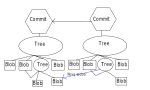

# Git pro pokročilé
### *Pali Rohár*
### *16.09.2019*

**Gitový objekt** - vrchol grafu

Název objektu = SHA1 hash (20 bytů --> 40 znaků)

Nástroje pro práci s objekty:
  - deFlate - dekompresní algoritmus který lze použít k dekompresi objektů
  - zlib-Flate kompresuje i dekompresuje objekty

Typy objektů
  - blob = soubor
    - obsah 
      - typ
      - [mezera]
      - délka
      - obsah
  - tree = adresář
    - uchovává, zda je soubor spustitelný nebo ne
    - obsah
      - unix zpráva
      - mezera
      - název souboru
      - SHA1 hash objektu, na který se má odkazovat potřebujeme-li daný soubor
  - commit
    - obsah
      - tree [SHA 1] (může jich mít *asi* víc)
      - parent [SHA 1] (může jich mít víc) - není u prvního commitu                                                                                                                                                                                                                                                                                                                                                                                                                                                                   
      - author [jméno < email >]
      - commiter [jméno < email >]
      - timestamp + časová zóna
      - [prázdná řádka]
      - commit zpráva

Graf se nazívá *merkle tree* a popisuje vztahy mezi objekty. Mimo jiné také návaznost commit objektů

**Tag** = odkaz na commit v historii - automaticky se neaktualizuje

**Branch** = odkaz na commit

Současný branch je uložený v *.git/HEAD*

*.git/objects/pack* = obsahuje zkomprimované objekty, které se odesílají na server z důvodu zrychlení přenosu

**Garbage collector** - packuje objekty a odstraňuje ty, na které nic neodkazuje, lze jej spoustit pomocí `git gc`

`git repack` - updatuje packy

index = obsahuje objekty, které nejsou zatím v HEAD, ale byly přidány pomocí `git add`

`git ls-Files` - zobrazí obsah indexu

*.git/remotes/< remote name >/ < branch name>* - obsahuje branche stáhnuté ze serveru

#### Příkazy
`git init [složka]` - založí prázdný repositář v zadané složce

`git clone <adresa serveru>` - zkopíruje repositář na serveru

`git add [--patch / --all]` - přidává soubor / adresář do indexu; --patch umožňuje přidat jednotlivé změny v souboru

`git rm [-r / --cached] <soubor>` - odstraňuje soubor / adresář z indexu; --cached neodstraní soubor z disku; -r = rekurzivně

`git mv` - přejmenovává nebo přesouvá soubor / adresář v indexu, ve skutečnosti je to *git rm* a *git add* v jednom

`git reset [--<soubory> / --patch]` - vezme soubory z HEAD, vytáhne je z tree a nacpe je do indexu; --patch funguje stejně jako u git add

`git checkout --<soubory> / --patch` - vezme soubory z HEAD a nahradí jimi soubory na disku (zresetují je na poslední commit); nově funguje i *git restore* a to naprosto stejně

`git diff [--cached /  --nameonly  / --stat / HEAD]` - zobrazí změny mezi pracovním adresářem a HEAD 

`git status` - zjišťuje a zobrazuje rozdíly mezi HEAD, index a pracovním adresářem

`git commit [--all]` - vytváří nový commit objekt

`git branch [<name> [<commit>] / -d ]` - vytváří nový branch (je to prakticky ihned); -d odstraní branch; -D vynutí odstranění i v případě, že by objekty již nebyly s ničím spojené

`git checkout < branch name >` - přepínání mezi branchy

`git log [--graph]` - zobrazí všechny dosažitelné commity

`git show` - zobrazí informace o jakémkoliv gitovém objektu

`git cat -p` - vypíše objekt

`git diff <commit 1>..<commit 2>` - zobrazí změny mezi dvěma commity

`git grep` - (něco s vyhledáváním)

`git merge <branch name>` - spojí dva branche

`git fetch` - stáhne změny ze serveru

`git pull` - git fetch + git merge v jednom

`*git push` - nahraje změny na server

#### Odkazy
*HEAD^1* - odkaz na prvního rodiče aktuálního commitu

*master~* - odkaz na minulý commit v kmeni master