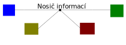
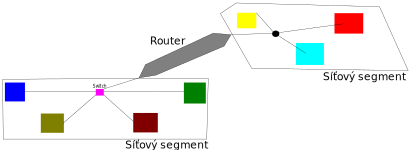
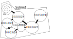
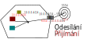

# Počítačové sítě I
### *Václav Šraier*
### *15.09.2019*

Počítače spolu komunikují skrz nosiče informací (kabely, vlnění,...)

Protokol - je domluveno, že zpráva obsahuje na začátku svou délku (to byl asi jen příklad)

Pokud červený vyšle zprávu modrému, došla by zpráva všem, protože všichni jsou napojení na jeden nosič informací

Do uzlu se proto dává **Switch**, který přijímá zprávy a a přeposílá je pouze na daný počítač

Počítače se neidentifikují barvou, ale tzv. Mac adresou - 48 bitové číslo ve formátu AA:BB:CC:DD:EE:FF

Mac adresa je nastavována výrobcem, který zajišťuje, že je adresa unikátní

První tři části adresy značí výrobce, zbytek je počítadlo

Problém switche je, že nemá neomezenou paměť - nemůže si pamatovat miliardu Mac adresa a vyhledávat v nich při každé zprávě

Pokud někdo začne spamovat různé Mac adresy do switche, zaplní jeho tabulku a switch je nucen zapomenout nějaké starší adresy. Když pak jiný účastník odešle soukromou zprávu, switch neví kam jí odeslat a pošle jí standardně všem. Toho pak využije spamovací útočník a zprávu zachytí

- L1 - fyzická vrstva (spojení všech počítačů obyčejným kabelem)
- L2 - linková vrstva (spojení všech počítačů do switche)
- L3 - síťová vrstva (viz níže)
- L4 - transportní vrstva (obsahuje port - číslo 0 až 65535, které určuje pro jakou aplikaci jsou data určeny)
- L5, (L6)

Při odesílání dat přes síťovou vrstvu se pošle obálka v L2 vrstvě do routeru, který si zkontroluje, že je pro něho, L2 zahodí a přebalí L3 uvnitř do nové L2 vrstvy, kterou pošle dál

IP adresy
- ip4 (*216.68.32.4*) (Maximálně pro 4 000 000 000 zařízení)
- ip6 (*fe80:001:001:1:1:1:1:41*)

Subnet: 216.68.32.4/24 == 255.255.255.0

Routery mají dvě IP adresy a pamatují si, do jakého segmentu se kudy dostanou.

**Protokol UDP** - je na L4 vrstvě a přidává port

**Protokol TCP** - Spolehlivé, ale pomalejší - přidává zprávám identifikátory a příjemce potvrzuje přijetí každého paketu

Přijímání a odesílání paketů (naštěstí) řeší operační systém

NAT = Network Address Translation
  - překládá privátní adresu na jiný identifikátor

