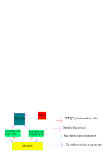

# SQL databáze
### *???*
### *20.09.2019*

Databáze se skládá z neomezeného počtu tabulek

Každá tabulka má definované sloupce a jejich typ

Do každého sloupce lze ukládat pouze daný typ dat

S databází se komunikuje pomocí SQL

**SQL** = **S**tructured **Q**uery **L**anguage

SQL mělo být podobné Angličtině a být sroznumitelné i pro laiky, ale moc se to nepovedlo

Klíčová slova nejsou case-sensitive

`SELECT jmeno FROM uzivatele WHERE pohlavy = "M" AND vek > 14;`

Každá tabulka musí mít primární klíč, který musí být unikátní pro každý řádek dat

Cizí klíče (Foreign keys) = klíče z jiných tabulek uložené v tabulce sloužící ke spojování dat v různých tabulkách
  - tabulka uzivatele: id, jmeno
  - tabulka prispevky: id, uzivatelId, obsah --> uzivateleId je cizí klíč sloužící k párování příspěvků k jejich autorovi

Databáze se automaticky pokouší optimalizovat operace, které jsou na ní prováděny

**Joinování tabulek** - spojení více tabulek do jednoho pohledu

`SELECT * FROM objednavky, uzivatele WHERE objednavky.uzivatelId = uzivatele.id`

`SELECT * FROM objednavky JOIN objednavky ON predmety.id = objednavky.predmet;`

**Řazení výsledků** - seřazení navrácených dat podle hodnoty v jednom (nebo více) sloupcích

`SELECT * FROM uzivatele WHERE vek > 17 ORDER BY jmeno` --> seřazení dospělých uživatelů podle jména (abecedně)

**Limitování výsledků**

`SELECT * FROM uzivatele WHERE id < 1000 LIMIT 50` --> zobrazení maximálně 50 řádků

**Seskupování výsledků**

`SELECT sum(cena), jmeno FROM objednavky JOIN predmety ON predmety.id = objednavky.predmet GROUP BY jmeno`

**Spočítání řádků v tabulce** (poměrně pomalé - projde se celá tabulka)

`SELECT count(*) FROM uzivatele`

**Kopírování tabulky**

`INSERT INTO novaTabulka SELECT * FROM staraTabulka`

**Aktualizace dat**

`UPDATE predmety SET cena = 2 WHERE nazev = "Mrkev";`

**Vnitřní dotazy**

`UPDATE predmety SET cena = cena * 2 WHERE id NOT IN (SELECT predmetId from objednavky);`
--> Zdražení všech předmětů, které si zatím nikdo neobjednal

**Transakce** = soubor SQL dotazů, které se provedou až při odeslání transakce (`COMMIT;`) --> chrání proti změně stejných dat ve stejnou dobu dvěma uživateli

Pokud provedeme nechtěnou akci (Například smazání tabulky), můžeme v transakci provést dotaz `ROLLBACK;`, který akci vyřadí. Toto je však možné pouze před uložením změn pomocí `COMMIT;`

`EXPLAIN ANALYZE <dotaz>` - analýza a vysvětlení dotazu - spočítání přibližné časové náročnosti