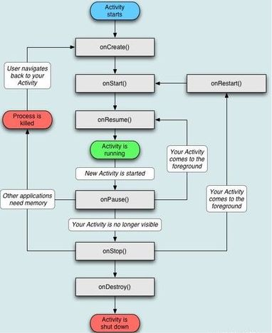

# Psaní pro Android
### *Jiří Setnička*
### *15.09.2019*

V jazycích:
  - Java (ukecaná)
  - Kotlin (méně ukecaný, ale novější a ne tolik rozšířený)

Android studio - platforma pro vývoj (původně plugin do Eclipse)

Aktivita = obrazovka (například seznam e-mailů)

Minimum API level - nejstarší verze operačního systému, se kterým bude aplikace kompatibilní
 > čím novější verze, tím více možností, ale tím menší podpora pro starší mobily

Layout aktivity - rozložení prvků v aktivitě uložené ve formátu XML

AVD manager = Android Virtual Device manager - umožňuje prohlížet aplikace na různých typech simulovaných zařízeních

Lze řešit události (například stisknutí tlačítka) - spustí se naše obslužná metoda, která provede nějakou akci

Metody mohou přidávat, odstraňovat či měnit prvky v aktivitě

Získání konkrétního prvku - *findViewById(R.id.pocitadlo)* --> Podobné jako v JavaScriptu

Nechceme-li mít v programmu tisíckrát *findViewById(?)*, můžeme použít anotaci *@bindView()R.id.pocitadlo*, je ale zapotřebí knihovna Butter Knife

Často se volá jedna funkce na více věcí a funkce poté rozhodne co dělat v závislosti na tom, co jí vyvolalo

strings.xml = obsahuje seznam řetězců použitých v aplikaci - hodí se při překládání aplikace do jiných (lidských) jazyků

Je potřeba vědět, jak nakládá Android s běžícími aplikacemi - obvykle zabije cokoliv co uživatel zrovna nepoužívá, pokud mu docházejí prostředky

Metoda *onCreate()*
  - nastavuje používaný layout
  - jako argument dostává *Bundle savedInstanceState*, který obsahuje uložené hodnoty

Metoda *onSaveInstanceState()*
  - je spuštěna, pokud si má aplikace uložit svůj stav
  - obvykle na pomezí *onStop()* a *onDestroy()*
  - ukládá data do *Bundle savedInstanceState*

Metoda *onRestoreInstantState()*
  - Načítá uložená data v *Bundle saveInstanceState*

K ukládání dat se používá metoda *Bundle.putInt(KEY, VALUE);*

K načítání dat se používá metoda *Bundle.getInt(KEY, VALUE);*

Shared preferences - trvalé úložiště dat (po dobu nainstalování aplikace)
  - Ukládání dat probíhá v transakci (vše najednou - nemůže se nedopatřením uložit jen část)

Intent - požadavek zobrazit jinou aktivitu
  - explicitní (do jiné aplikace)
  - implicitní (do té samé aplikace)

[Zde je zbytek](https://developer.android.com)